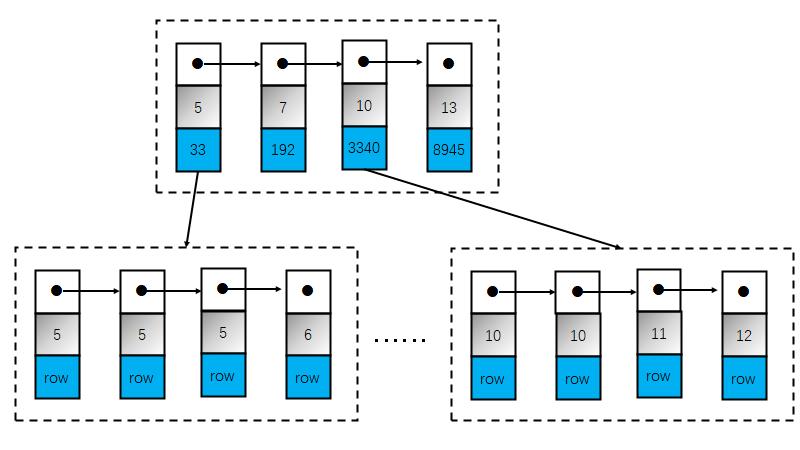

# 思路说明

## Task1

在数据无序的情况下, 也即没有为数据建立任何索引:
1. 在建立数据库时指定了a为主键(或者b), 那么数据会按照a排序(或者b), 
   那么按照主键a(或者b)缩小查找范围, 进一步根据列b(或者a)得出符合查询条件的结果;
2. 如果a和b均不是主键, 只能全表扫描判断(不论是假设数据都能读取到内存中, 还是内存不足以存放所有磁盘数据),
   并逐个打印数据. 基于这个假设, 函数task1()代码如下:

```cpp
/*!
 * Task 1.
 *
 * Find out all the rows that sastify below conditions:
 *
 * ((b >= 10 && b < 50) &&
 * (a == 1000 || a == 2000 || a == 3000))
 *
 * Print them to the terminal, one row per line, for example:
 *
 * 1000,20
 * 1000,23
 * 2000,16
 *
 * @param nrows     The total number of rows.
 * @param rows      The rows, for example rows[0] is the first row.
 */
void task1(const Row* rows, int nrows) {
    for (int i = 0; i < nrows; ++i) {
        if ((rows[i].a == 1000 || rows[i].a == 2000 || rows[i].a == 300) &&
            (rows[i].b > 10 && rows[i].b < 50)) {
            printf("%d,%d\n", rows[i].a, rows[i].b);
        }
    }
}
```

## Task2

### 优化1(1层B+树, 假设数据都能读取到内存中)

数据按照(a, b)排序, 也即数据为(a, b)建立了联合索引.
> 理论上可以为a和b分别建立索引, 但这无疑会增加存储空间, 同时a和b的排序的独立, 会增加查询时间. 
> 因此为查询的每个列都建立索引--多级索引, 还是某几个列共同建立一个索引--联合索引, 
> 需要根据实际的数据而定.
那么就可以按照a, b的次序使用二分法快速定位到准确的位置, 逐个打印数据:
1. 首先使用二分法对a快速定位到 $[5, 10]$
2. 然后在刚才的查找结果中比对列b的值, 进而得出结果
函数task2()代码如下:

```cpp
/*!
 * Task 2.
 *
 * optimization of Task1 with the condition that
 * rows have been sorted by (a, b)
 *
 * Sample Input:
 * Row sorted_rows[] =
 * {
 * { 1000, 31 },
 * { 1000, 72 },
 * { 1500, 12 },
 * { 1500, 34 },
 * { 2000, 22 },
 * { 2000, 33 },
 * };
 *
 *
 * Sample Output:
 *
 * 1000,31
 * 2000,22
 * 2000,33
 *
 * @param nrows     The total number of rows.
 * @param rows      The rows, for example rows[0] is the first row.
 */
void task2(const Row* rows, int nrows) {
    int from = first_greater_than_key(rows, nrows, 5);
    int to = last_less_than_key(rows, nrows, 10);
    for (int i = from; i <= to; ++i) {
        if (rows[i].b == 1000 || rows[i].b == 2000 || rows[i].b == 300) {
            printf("%d,%d\n", rows[i].a, rows[i].b);
        }
    }
}
```

### 优化2(1层B+树, 假设数据都能读取到内存中)

进一步优化, 只使用a定位出来的范围内的数据可能依旧庞大, 甚至会有多个相同b值的行,
此时应当使用b的查询条件继续二分, 缩小范围, 得到三个区间 $[1000, 1000]$, $[2000, 2000]$, $[3000, 3000]$.
此范围内的所有数据即为所需查询结果. 优化后的函数task2_opt()代码如下:
```cpp
void task2_opt(const Row* rows, int nrows) {
    for (int i = first_greater_than_key(rows, nrows, 5);
         i <= last_less_than_key(rows, nrows, 10); ++i) {
        for (int j = binary_search_leftmost_by_b(rows, nrows, 1000);
             j <= binary_search_rightmost_by_b(rows, nrows, 1000); ++j) {
            printf("%d,%d\n", rows[j].a, rows[j].b);
        }

        for (int j = binary_search_leftmost_by_b(rows, nrows, 2000);
             j <= binary_search_rightmost_by_b(rows, nrows, 2000); ++j) {
            printf("%d,%d\n", rows[j].a, rows[j].b);
        }

        for (int j = binary_search_leftmost_by_b(rows, nrows, 3000);
             j <= binary_search_rightmost_by_b(rows, nrows, 3000); ++j) {
            printf("%d,%d\n", rows[j].a, rows[j].b);
        }
    }
}
```


### 优化3(多层B+树, 假设数据不能全部读取到内存中)

task2的优化1和优化2都使用了1层B+树来存储索引结构, 还假设数据都能读取到内存中. 
然而题目所提及的场景中, 数据量很大, 很有可能无法全部读取到内存中, 只能分块读取, 这两种方法就捉襟见肘了.

更进一步的优化是索引存储采用多层B+树, 底层叶子节点存储用户数据记录的索引, 
上一层节点存储下一层节点的索引(即索引的索引), 那么此时的查找过程就是(以2层B+树为例, 多层B+树同理):


1. 首先进入存储索引的索引节点内(第一层的节点)通过二分法比对列a, 找到5和10, 
   定位到存储用户数据的开始节点是33号, 结束节点是3340号;
2. 然后在33号节点和3340号节点分别使用二分法, 定位到具体范围;
3. 去执行磁盘I/O, 读取数据并打印.

上述过程中如果索引结构是类似于InnoDB的方式--索引即数据, 那么直接读取数据即可;
如果是类似于MyISAM的方法--索引是索引数据是数据, 需要先访问索引文件, 再根据访问结果执行磁盘I/O.


## Task3

在Task2的基础上, 对输出的结果按照B进行排序, 只能将符合查询条件的数据全部读取到内存中, 再排序输出(即外排序).
如果符合查询条件的数据太多, 甚至超过了内存的大小, 那么就需要借助磁盘存放排序中间结果, 在排序结束后将所有的结果打印出来.
> 由于任务2中为(a, b)建立了联合索引, 顺序是先按照a排序, 当a相同时, 再按照b排序.
> 而Task3要求结果按照b排序, 就破坏了联合索引的结果, 只能将符合查询条件的结果排序好再打印

一种实现该外排序的方法是:
1. 把大文件，分成若个能在内存中排序的小文件;
2. 这些小文件内部排好序之后, 用堆排序来做多路合并的操作, 从而合并成一个大的文件:
   1. 首先遍历所有的小文件(假设1000个)，每个文件里面取第一个数字，组成(数字, 文件号)这样的组合加入到堆里，遍历完后堆里有 1000 个(数字, 文件号)这样的元素;
   2. 然后不断从堆顶 pop 元素追加到结果集，每 pop 一个元素，就根据它的文件号去对应的文件里，补充一个元素进入堆中，直到那个文件中的元素被拿完;
   3. 按照上面的操作，直到堆被取空了，此时最终结果文件里的全部数字就是有序的了

